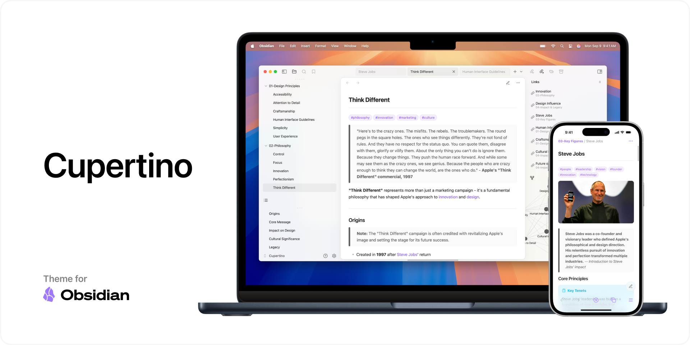
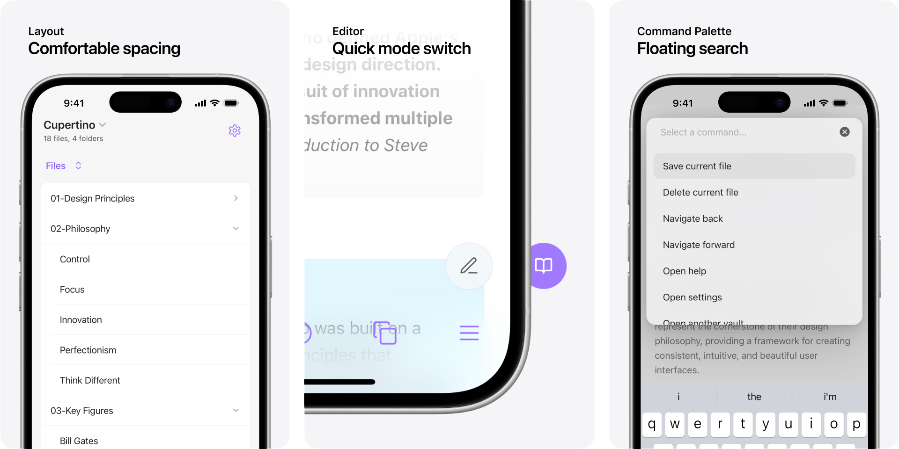

# Cupertino for Obsidian

Cupertino is a theme that brings native experience to Obsidian.

## Features

- **Native & minimal** — Clean, native look and feel on all of your devices, so you can focus on your content.

    

- **Optimized for mobile** — Redesigned modals, menu, editor, search, and more, with comfortable spacing for usability.

    

- **Windows Mode** — Fluent Design UI for native feeling on Windows (Enabled by default, can be disabled with [Style Settings](https://github.com/mgmeyers/obsidian-style-settings))

    

> [!NOTE]
> Make sure to enable "Translucent window" in Obsidian Appearance settings.
  
## Plugins

All features are enable by default, following plugins can be installed to modify your installation. they are **_not_** required.

### [Style Settings](https://github.com/mgmeyers/obsidian-style-settings)
- Disable auto hiding elements
- Disable active line indicator
- Disable centered status bar
- Disable centered tabs
- Disable frontmatter foldable heading
- Disable full width table
- Disable Windows Mode
- Enable accented window

### [Cupertino Helper](https://github.com/aaaaalexis/obsidian-cupertino-helper/) (Desktop)
- Add pseudo-Mica (wallpaper as background) on Windows
- Fix misaligned window control buttons on macOS

## Philosophy

I’ve spent way too much time on customizing Obsidian, thousands of themes with millions of customizations, I believe a lot people do it too. It’s anti-productivity at this point, we need something that just works and is pleasant to use.

1. **Less plugins.** — Plugins are only used for disabling features and fixing issues instead of adding. Cupertino works perfectly out of the box.
2. **Less customizations** — Cupertino will never have customization. More customization make you waste more time on fiddling.
3. **Less visual noise** — Content is the key. Cupertino makes Obsidian blend in system style, so you can focus on what you're typing.

Cupertino is designed as I use Obsidian, while I'm trying to focus on being consistent, inconsistency happens. If you spot any, feel free to submit issues.

## Performance

Cupertino is very resource heavy due to the amount of blur and calculation used. Performance issue is known and will not be fixed nor addressed further. Unless Obsidian optimizes the app, I can't do anything about it.

## Support

You can follow Cupertino's development or my future work on my [Twitter](https://x.com/cittoj).

[Support me and my work](https://www.buymeacoffee.com/cittoj) so I can keep regular updates and fixes. You’re also welcomed to submit pull requests.

## Credits

- **@mgmeyers** — [California Coast Obsidian Theme](https://github.com/mgmeyers/obsidian-california-coast-theme)
- **@colineckert** — [Things 2 (Quick Mode Switcher)](https://github.com/colineckert/obsidian-things)
- **@krios2146** — [Obsidian GitHub Theme (Codeblock Styling)](https://github.com/krios2146/obsidian-theme-github)
- **@FireIsGood** — [Table Rounded Corner](https://forum.obsidian.md/t/60551)
